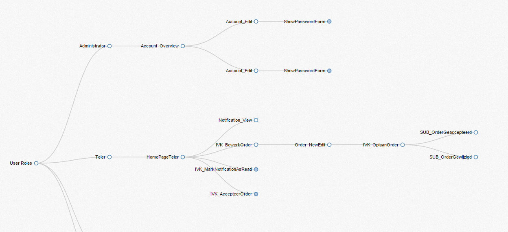

# SDK User Visualisation
## Setup
To set up and use the sdk you need to have node js installed on your machine.

To install the sdkuservisualisation you should type the command:

`npm install`

This is will install the sdk visualisation and all the relevant dependencies.

To connect it to your project you need to set environment variables or create a `.env` file in the root the project.
Set the variables:
```
USER_NAME={{User name}}
API_KEY={{Api Key}}
PROJECT_ID={{Project Id}}
PROJECT_NAME={{Project Name}}
```

API keys can be found in the Mendix home portal.

## Use the visualisation
Once the visualiser is installed type:
`npm run start`

This will compile the visualisation code and to start running the script. Once the script has completed visualising your project it will load up a browser to display the visualisation.

</img>
